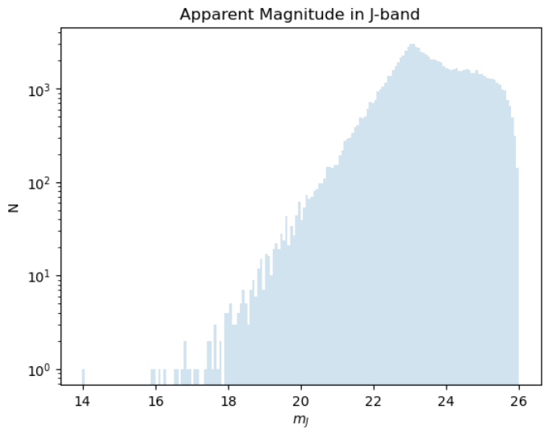

<<<<<<< HEAD

# Distribution of Brown Dwarfs Based on Apparent Magnitude

## 1. Overview
The purpose of our research was to simulate the distribution of low-mass stars (i.e. brown dwarfs) in our solar neighborhood over their apparent magnitude and compare it against the actual distribution given by the data from large photometric sky surveys like DES and LSST. We would also like to be able to convert these distributions and plot them for different passbands. The resulting plot of $\frac{dN}{dm}$ versus $m$ in J (original), z, and Y-bands.




## 2. Installation 

Install with conda:
```bash
conda env create -f environment_setup.yaml
```
Activate environment:
```
conda activate fast_pm_stars
```
## 3. Neccessary* Data and Models
Filter transmissions were taken from the CTIO Dark Energy Camera (DECam) transmissions in [r](http://svo2.cab.inta-csic.es/svo/theory/fps3/index.php?id=CTIO/DECam.r&&mode=browse&gname=CTIO&gname2=DECam#filter), [i](http://svo2.cab.inta-csic.es/svo/theory/fps3/index.php?id=CTIO/DECam.i&&mode=browse&gname=CTIO&gname2=DECam#filter), [z](http://svo2.cab.inta-csic.es/svo/theory/fps3/index.php?id=CTIO/DECam.z&&mode=browse&gname=CTIO&gname2=DECam#filter), and [Y](http://svo2.cab.inta-csic.es/svo/theory/fps3/index.php?id=CTIO/DECam.Y&&mode=browse&gname=CTIO&gname2=DECam#filter) passbands: http://svo2.cab.inta-csic.es/svo/theory/fps3/index.php?mode=browse&gname=CTIO&gname2=DECam&asttype=

The [Sonora Bobcat model](https://zenodo.org/records/5063476) contains models for substellar mass objects described in the [Marley (2021)](https://ui.adsabs.harvard.edu/link_gateway/2021ApJ...920...85M/PUB_PDF) paper. The spectra model was used to obtain spectral fluxes that were strictly monochromatic and at the top of the atmosphere when given information on effective metallicity, temperature, and log(g). Metallicity was fixed at -0.5 and temperature and log(g) ranges were $1400 K \leq T_{eff} \leq 2400$ and $3 \leq log(g) \leq 5$ respectively.

$T_{eff}$, $M_J$, and $log(g)$ values for stars aged 1 Gyr were taken from Table 3 from [Chabrier et al. (2000)](https://iopscience.iop.org/article/10.1086/309513/pdf).

*[The Phoenix models for Synphot](https://www.stsci.edu/hst/instrumentation/reference-data-for-calibration-and-tools/astronomical-catalogs/phoenix-models-available-in-synphot) by Allard et al. (2009) were used in other simulations but hasn't been incorporated into the main one yet.

## 4. Miscellaneous and Other Simulations
The _Misc_ folder contains some test plots of black body radiation (blackbody-plot.ipynb),  sampling using Gaussian and power law distributions (Distributions.ipynb), test plots of apparent magnitude difference as a function of flux ratio and Salpeter-like IMFs (Flux-IMF.ipynb), counts versus masses for a Salpeter-like IMF (Count-vs-Solar-Mass.ipynb), and values of total flux calculated by integrating the black body function for different temperatures over LSST y-band wavelengths (LSST-y-band.ipynb).

The _Simulations_ folder contains a comparison plot of the black body radiation and Phoenix model for the sun (Blackbody-vs-Phoenix-Synphot.ipynb), values of different colors from DES passbands/absolute magnitude differences between z, Y, r, and i-bands (DES_Color.ipynb),  a plot of the luminosity function [Cruz et al. (2007)](https://ui.adsabs.harvard.edu/link_gateway/2007AJ....133..439C/PUB_PDF) (dN-dR-and-half-norm-data.ipynb) modeled by a half-normal and power law models (Luminosity-Function-MJ.ipynb), plot of an apparent magnitude histogram where values for $r$ were sampled from the distribution from the plot of $\frac{dN}{dr}$ and values for absolute magnitude were sampled from a half-normal distribution (that was fitted to the luminosity function in [Cruz et al. (2007)](https://ui.adsabs.harvard.edu/link_gateway/2007AJ....133..439C/PUB_PDF) (dN-dR-and-half-norm-data.ipynb),.

## 5. Running the Pipeline
## Acknowledgements
It was a great pleasure working with my mentors Kostya Malanchev and Dr. Mandelbaum and peer Joao Passos and I would like to thank them for their much needed help and support throughout this project.
## Notes
Need to include model (incoporate phoenix) for temperatures greater than 2400 K.
r and i bands not used because not increasing monatonically.
=======
## move dN/dm main file outside

## Short description/overview
## Installation (yaml) pip installs all the packages in conda
## Models Used
For effective temperatures greater than 2400K, the [Phoenix Model was used]().


## how to run pipeline
## acknowledgements
## Notes
>>>>>>> fc29b72804de05b807473151350113c9f90ba723
